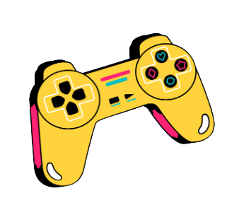

# GameBreakers

  

## Table of content 📃

* [About](#About)

* [Used for creation](#Used-for-creation)

* [Team](#Team)

* [Preview](#Preview)

## About❓

Our project is about a: **Adventure game, in which you play as a paladin and are trying to fight through the waves of enemies comming your way.** This is supported by **Our website** which you can visit form this repo. 

## Used for creation🔧

* *Game* - Developed with Unreal Engine 4

* *Visual studio code* - for writing the HTML, CSS and JS for the site and creating the README

* *GitHub* - for commiting the project and sharing it

* *Photoshop* - for creating the logo and editing some of the pictures

* *Word and PowerPoint* - for creating the documentation and presentation

* *Discord* - for comunication

## Team👋

* **Dobrin Peychev** - Scrum Trainer/QA Engineer - <DIPeychev19@codingburgas.bg>

* **Nikolai Brankov** - Scrum Trainer/QA Engineer - <NPBrankov19@codingburgas.bg>

* **Andrey Azmi Mutul** - Backend Developer - <AAMutlu20@codingburgas.bg>

* **Alexander Baev** - Backend Developer - <AIBaev20@codingburgas.bg>

* **Georgi Kotakov** - Backend Developer - <GGKotakov20@codingburgas.bg>

* **Apostol Qnev Kupenov** - Frontend Developer - <AYKupenov21@codingburgas.bg>

* **Stoyan Skuliev** - Frontend Developer - <SGSkuliev21@codingburgas.bg>

## Preview👩‍💻

  

  

